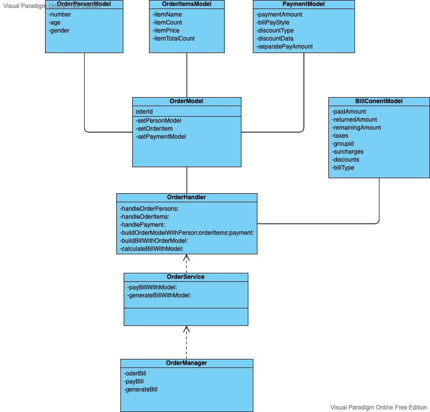

#  Coding Task

## Demand
1. Create a structure to handle the data,
2. Display the Invoice with the appropriate group identification, taxes, surcharges, discounts, etc
3. Display each transaction as Paid $XX, returned $YY, remaining $ZZ

## Design
The restaurant as a subject: is a typical producer and consumer data model, the restaurant each single business will be accompanied by the production and consumption of a production:
Data inputs include: diner, order content, product unit price, offer content, payment method
Data output includes: billing results

* When designing the data model, the data storage type should be reasonably designed, and the scalability of the object should be considered to facilitate the update and maintenance of the content, such as product categories, billing categories, payment methods, and offer types.
* In the input parameters control, as far as possible compatible with different types of data formats, such as the number of people, commodity prices, discount prices, for different data formats can be parsed, and access to the legal type of input, for the type can not be identified, the need for data statistics, exception handling
* Output content control: different output types need to be considered, such as output invoices, Excel tables, custom bill display, bill output through the JSON data model as far as possible to output the corresponding data, and then for the bill requirements, data processing.

Finally, we need to consider: the storage structure of these data, which needs to be saved in the database and can be analyzed for the operation of the restaurant. This design model is designed only for the sales link: need to consider how the restaurant's incoming, sales, storage and other links, how to do the data linkage. As far as possible to achieve a single responsibility, easy to maintain later.

## Data
Each business generates the following data and the data model includes

### OrderModel
1. Model1: OrderPerson,each group has different number
    * person numbers
        e.g.:5
    *extended attributes
        e.g.:age/gender
    
2. Model2: PaymentModel
    * PaidAmount
        e.g.:$100
    
    * billPayType
        * split equally payment
        * one person payment
        
    * discountType: bill discount,the data model use double types
        * percent type (amount*(1-discoutData))
        * price type   (amount - discoutData)
    
    * discountData
        e.g.:$16/10%
        
    * separatePayAmount: total amount minus billTab 
        e.g.:$25
        
    
3. Model3: OrderItems
    * ItemName:Items need to be set to be expandable
        Big Brekkie
        Bruschetta
        Coffee
        Garden Salad 
        Poached Eggs
        Soda 
        Tea
        ...
        
    * ItemPrice:double types
        e.g.:$16
        
    * ItemCount:double types,Some items may have non-integer numbers
        e.g.:X3/#3
    
4. Model4: BillContent
    * paidAmount
    * returnedAmount
    * remainingAmount
    * groupId
    * taxes
    * surcharges
    * discounts
    * ....
    
5. Model5: OrderModel
    * orderId
    * orderPerson
    * paymentModel
    * orderItems

## UML-TimeLine
[TimeLine]()

## UML-Class
)

## UnitTest

 
